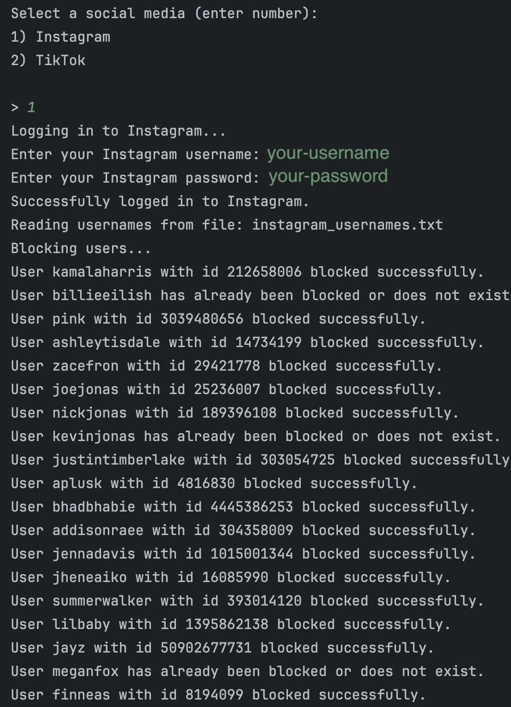

# BlockOut2024 Automated Script

BlockOut2024 is an automated script designed to help you block a predefined list of celebrities from Instagram.

## Features

- Automatically logs into your Instagram account.
- Reads a list of usernames from a text file.
- Blocks the listed users, providing a success or error message for each.

## Setup

Clone the repository to your local machine:

```shell
git clone https://github.com/incandenza-11/blockout2024.git
cd blockout2024
```

## Run

### Docker

Have [Docker](https://docs.docker.com/desktop/install/windows-install/) installed and running.

1. Run it inside docker:

```shell
docker-compose run -it --build blockout
```

Alternatively, you can just use the shortcut:

```shell
make start
```

### Regular

1. Run the following command to install required dependencies:

```shell
pip install -r requirements.txt
```

2. Execute the script:
```shell 
python3 main.py
```

### **Important**:
This script requires your Instagram username and password to log in to your account. The credentials are used locally on your machine and are not stored or transmitted to any third party.

### Usage example
When you run the script, it will prompt you to enter your Instagram username and password. The script will then log in to your account, read the list of usernames from the instagram.txt file, and attempt to block each user. It will provide a message indicating whether the blocking was successful or if the user was already blocked or does not exist.


The list of usernames that will be blocked when executed are:

- `resources/usernames/instagram.txt` for Instagram

## File Structure

- `main.py`: The main script that executes the blocking functionality.
- `requirements.txt`: Lists the Python dependencies required by the script.
- `resources/usernames/`: The directory where all the usernames to be blocked are located; categorized by social media type.

## Contributing

If you'd like to contribute to this project, please fork the repository and use a feature branch.

## License

This project is licensed under the MIT License - see the `LICENSE` file for details.

## Acknowledgements

Special thanks to the contributors of the `instagrapi` package for providing a robust API for interacting with Instagram.
