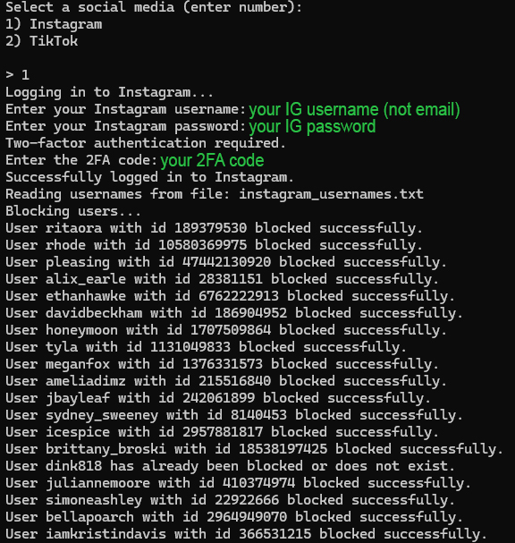

# BlockOut2024 Automated Script w/ 2FA

Automated script for BlockOut2024 to easily block celebrities from Instagram. (TikTok compatibility in progress.)


## Setup

1. Clone the repository to your computer.
2. Run the following command to install required dependencies:

```shell
pip install -r requirements.txt
```

3. Execute the script:
```shell 
python3 main.py
```


### **Important**:
This script will ask you to provide both your username and password to be able to log in your accounts. 
This repository does not keep track of any sensitive data as it is executed in your computer locally. 


### Usage example



## Contribute

The list of usernames that will be blocked when executed are:

- `instagram_usernames.txt` for Instagram
- `tiktok_usernames.txt` for TikTok

Feel free to contribute to this project to keep both username lists updated.
